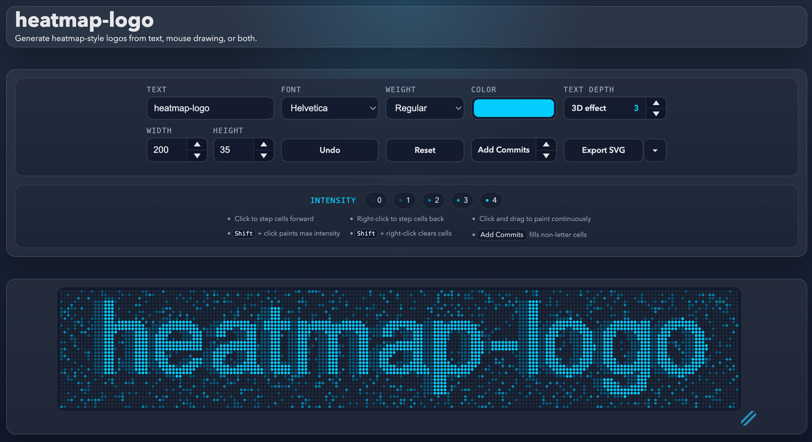

  

heatmap-logo is a browser tool for creating GitHub contribution graph-style text logos. Type your text, adjust the grid, clean up cells by hand if needed, and export the result as SVG.

- Generate a text-based heatmap logo with options for font, color, weight, size, and more
- Edit cells directly with click and drag
- Use `Add Commits` to add random noise around the text
- Optional 3D depth effect with adjustable intensity
- Runs entirely in the browser
- Exports SVG or PNG

## Try the [live tool](https://adamspain.com/heatmap-logo/)!

**Preview:**

