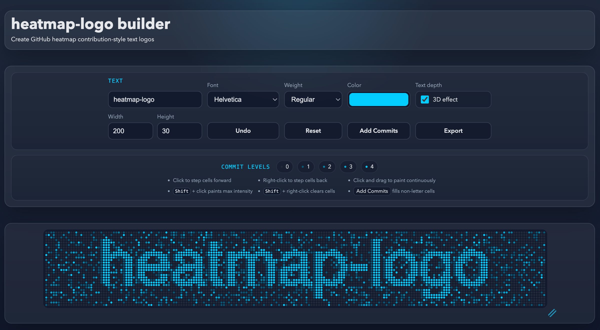

  

heatmap-logo is a browser tool for creating GitHub contribution graph-style text logos. Type your text, adjust the grid, clean up cells by hand if needed, and export the result as SVG.

- Generate heatmap-style text with font, color, weight, and canvas controls
- Edit cells directly with click, drag, and intensity controls
- Use Add Commits to make the result look less rigid
- Add an optional depth effect
- Runs entirely in the browser and exports SVG

Try the [live tool](https://adamspain.com/heatmap-logo/).

